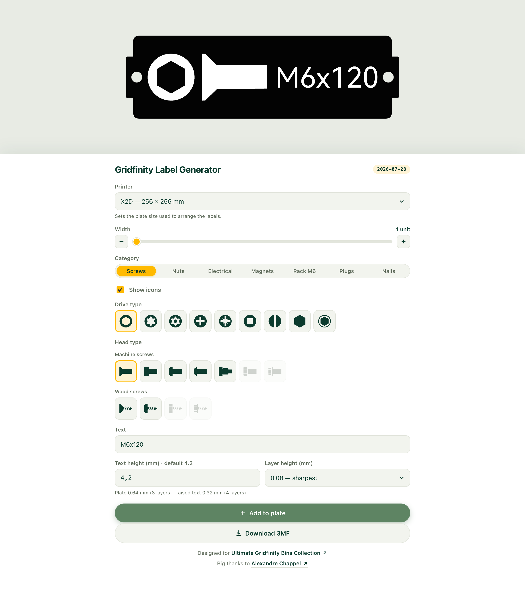

# [Gridfinity Label Generator](https://moifort.github.io/label-generator/)

Labels clip into the rails of standard Gridfinity bins, and are designed for the [Ultimate Gridfinity Bins Collection](https://makerworld.com/fr/models/47599-ultimate-gridfinity-bins-collection-parametric#profileId-49320).



## Features

- **Category icons** — screws, nuts, electrical, magnets, rack M6, plugs and nails.
- **Customizable** — custom text, with or without an icon.
- **Size** — 1U to 3U.
- **Bulk print** — stack several labels on one plate and export them in a single 3MF.

## Contributing

Missing an icon, a category or a printer? [Open an issue](https://github.com/moifort/label-generator/issues) to ask for it, or send a [pull request](https://github.com/moifort/label-generator/pulls) — the app ships as a single self-contained `index.html`, so changes stay easy to review.

The interface uses the [shadcn/ui](https://ui.shadcn.com) design system on Tailwind. Styles are written in `src/app.css` and compiled into the `<style id="app-css">` block of `index.html`:

```bash
npm install && npm run css
```

Rerun that after touching the markup — Tailwind only keeps the classes it finds, so a new class without a rebuild gets no styles.

## Credits

Designed for the [Ultimate Gridfinity Bins Collection](https://makerworld.com/fr/models/47599-ultimate-gridfinity-bins-collection-parametric#profileId-49320). Big thanks to [Alexandre Chappel](https://www.alch.shop).
